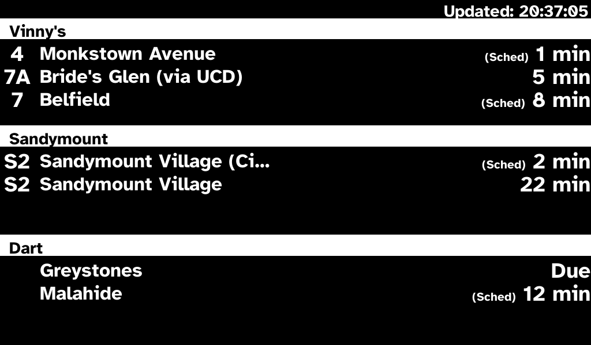

# TFI Display

Real-time bus/tram departure board for Raspberry Pi. Fetches live GTFS data from the Transport for Ireland API and renders it to a 7" LCD HAT via `/dev/fb0`.



## Hardware

- Raspberry Pi Zero 2W
- 7" LCD HAT (1024×600 DPI panel)

## Raspberry Pi OS

Install **Raspberry Pi OS Lite (64-bit, Bookworm)**. The binary is ARM64 and writes directly to `/dev/fb0` — no desktop required.

## Pi Firmware Config

Add these lines to `/boot/firmware/config.txt` under the `[all]` section:

```
dtoverlay=vc4-kms-dpi-generic
dtparam=hactive=1024,hfp=40,hsync=48,hbp=150
dtparam=vactive=600,vfp=3,vsync=10,vbp=21
dtparam=clock-frequency=49000000
dtparam=rgb666-padhi
```

Also add the following to the end of the single line in `/boot/firmware/cmdline.txt` (space-separated, no newline):

```
vt.global_cursor_default=0 consoleblank=0
```

This hides the kernel console cursor and prevents the framebuffer from blanking after inactivity.

Reboot — the LCD will appear as `/dev/fb0`.

### VCOM Adjustment

The LCD HAT has a small VCOM potentiometer screw on the board. Turn it slowly with a small screwdriver while the display is showing content to adjust contrast/brightness. There is a sweet spot where the white background is clean and text is crisp.

## TFI API Key

Register for a free key at https://developer.nationaltransport.ie/

## Configuration

```sh
cp config.yaml.example config.yaml
```

Minimal `config.yaml`:

```yaml
api_key: "your-key-here"

stops:
  - stop_number: "478"
    label: "Stop A"
  - stop_number: "2808"
    label: "Stop B"

display_model: "lcd"
```

Optional fields: `routes` (filter by route short name), `poll_interval_seconds` (default 60), `max_minutes` (default 90), `framebuffer_device` (default `/dev/fb0`).

## Build & Deploy

**Prerequisites:** Go installed on your development machine, SSH access to the Pi.

1. Update `PI_HOST` in the `Makefile`.
2. Run:

```sh
make deploy
```

This cross-compiles an ARM64 binary, copies it and the systemd service file to the Pi, then enables and starts the service.

> `config.yaml` is also copied if present locally.

## Service Management

```sh
# View live logs
journalctl -u tfi-display -f

# Restart after config change
systemctl restart tfi-display

# Check status
systemctl status tfi-display
```

## Development / Mock Mode

Run locally without any hardware — frames are written as PNG files:

```sh
make run-mock
```

Output goes to `mock_output/`. The mock uses the same 1024×600 LCD layout.
