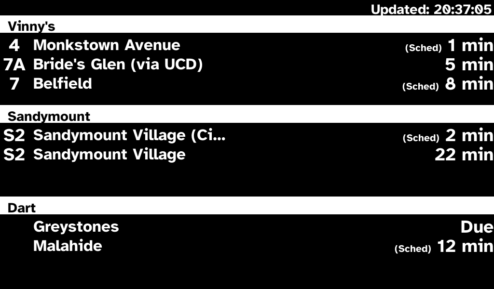

# TFI Display

Real-time bus/tram departure board for Raspberry Pi. Fetches live GTFS data from the Transport for Ireland API and renders it to a 7" LCD HAT via `/dev/fb0`.



## What you'll need

- A Raspberry Pi Zero 2W
- A 7" LCD HAT (1024×600 DPI panel)
- A microSD card + a way to flash it (e.g. Raspberry Pi Imager)
- A computer with [Go](https://go.dev/dl/) installed, on the same network as the Pi, with SSH access to it
- A free TFI API key (registered in step 4)

Setup is done once from your computer via `make deploy` over SSH — no manual file copying required.

## 1. Flash Raspberry Pi OS

Flash **Raspberry Pi OS Lite (64-bit, Bookworm)** to the microSD card. The display binary is ARM64 and writes directly to `/dev/fb0`, so the Lite (no desktop) image is enough. When flashing, enable SSH and set a hostname/username/password (or an SSH key) so you can reach the Pi headlessly.

Boot the Pi and confirm you can SSH into it:

```sh
ssh pi@<pi-hostname-or-ip>
```

## 2. Configure the LCD panel

Add these lines to `/boot/firmware/config.txt` on the Pi, under the `[all]` section:

```
dtoverlay=vc4-kms-dpi-generic
dtparam=hactive=1024,hfp=40,hsync=48,hbp=150
dtparam=vactive=600,vfp=3,vsync=10,vbp=21
dtparam=clock-frequency=49000000
dtparam=rgb666-padhi
```

Append the following to the end of the single line in `/boot/firmware/cmdline.txt` (space-separated, no newline):

```
vt.global_cursor_default=0 consoleblank=0
```

This hides the kernel console cursor and stops the framebuffer from blanking after inactivity.

Reboot the Pi — the LCD should appear as `/dev/fb0`:

```sh
sudo reboot
```

### VCOM adjustment

The LCD HAT has a small VCOM potentiometer screw on the board. With the display showing content, turn it slowly with a small screwdriver to adjust contrast/brightness. There's a sweet spot where the white background is clean and text is crisp.

## 3. Get a TFI API key

Register for a free key at https://developer.nationaltransport.ie/ — you'll need it in the next step.

## 4. Configure the app

On your development machine, in this repo:

```sh
cp config.yaml.example config.yaml
```

Edit `config.yaml` — at minimum, set your API key and stops:

```yaml
api_key: "your-key-here"

stops:
  - stop_number: "478"
    label: "Stop A"
  - stop_number: "2808"
    label: "Stop B"

display_model: "lcd"
```

Find `stop_number` values by looking up your stop on [transportforireland.ie](https://www.transportforireland.ie/) or the TFI Live app — it's the number printed on the physical stop pole.

Optional fields: `routes` (filter by route short name), `poll_interval_seconds` (default 60), `page_interval_seconds` / `max_pages` (paging through arrivals), `max_minutes` (default 90), `framebuffer_device` (default `/dev/fb0`), `start_time` / `stop_time` (wake/sleep schedule). See `config.yaml.example` for the full list with comments.

> Keeping `api_key` in `config.yaml` is fine for a single device. If you'd rather keep secrets out of the config file entirely (e.g. before committing it anywhere), put `api_key` in a separate `secrets.yaml` instead — see `secrets.yaml.example`. If `secrets.yaml` exists and sets `api_key`, it takes priority over the one in `config.yaml`; if it's absent, `config.yaml`'s `api_key` is used (the systemd service always points at `/etc/tfi-display/secrets.yaml`, but a missing file there is not an error).

## 5. Build and deploy

1. Update `PI_HOST` in the `Makefile` to match your Pi (e.g. `pi@raspberrypi.local`).
2. From your development machine, run:

```sh
make deploy
```

This cross-compiles an ARM64 binary, copies it and the systemd service file to the Pi over SSH, copies `config.yaml` if present locally, then enables and starts the `tfi-display` service. No manual steps on the Pi are needed.

## 6. Verify it's running

```sh
ssh <pi-host> "systemctl status tfi-display"
ssh <pi-host> "journalctl -u tfi-display -f"   # live logs
```

The LCD should show your configured stops with live arrival times within a minute or so. If it doesn't, check the logs above for API key or config errors.

### Keeping it running for weeks

Two Pi-specific gotchas will otherwise catch up with a board left on
indefinitely. Both are worth doing once at setup time.

**Turn off WiFi power save.** The Pi Zero 2W's onboard `brcmfmac` WiFi
enters power save by default and silently drops established TCP
connections — the socket stays open, the read never returns, and any
unbounded HTTP request parks its goroutine forever. The app now bounds
every request (see `gtfs/httpclient.go`), so this can no longer wedge the
board, but disabling power save avoids the failed polls entirely:

```sh
ssh <pi-host> "sudo iw dev wlan0 set power_save off"                 # now
ssh <pi-host> "echo 'options brcmfmac roamoff=1 feature_disable=0x82000' | sudo tee /etc/modprobe.d/brcmfmac.conf"   # persist across reboots
ssh <pi-host> "iw dev wlan0 get power_save"                          # verify: 'off'
```

**The Pi has no battery-backed clock.** With no RTC it restores the last
known time at boot (`fake-hwclock`) and only becomes accurate once NTP
syncs. Every arrival time on the board is derived from the system clock, so
a wrong clock means wrong departures. `tfi-display.service` orders itself
after `time-sync.target` for this reason. Check sync with:

```sh
ssh <pi-host> "timedatectl"     # want: 'System clock synchronized: yes'
```

If the header shows `! STALE` next to the timestamp, the board has stopped
receiving live data and every listed arrival is a scheduled time, not a
realtime one. Check `journalctl -u tfi-display -n 50` — and note the
watchdog (`feed_watchdog_seconds`, 30 minutes by default) will restart the
service on its own if the feed never comes back.

## Making changes later

After editing `config.yaml` or the code, just re-run `make deploy` — it rebuilds and restarts the service. To restart without redeploying:

```sh
ssh <pi-host> "sudo systemctl restart tfi-display"
```

## Auto-Updates (optional)

`tfi-display` — the binary built and deployed above — talks to the TFI GTFS API for its core function; there is no auto-update logic in it and no hard dependency on any particular server. It optionally reports its own activity log to the same self-hosted backend described below (see *Remote Logging*), but that's a best-effort diagnostic sink, not a dependency — `tfi-display` runs exactly the same with it unset.

`tfi-agent` is a **separate, optional** binary (`make build-agent-pi`, `make deploy-agent`) for anyone who wants to push binary/config updates to one or more devices from their own server, instead of SSHing in for every change. It is not built or installed unless you explicitly run those targets, and even then it does nothing until `base_url` (your update server's origin) is set in `secrets.yaml`.

If you want to self-host an update server, `tfi-agent` expects three endpoints:

| Endpoint | Auth | Purpose |
| --- | --- | --- |
| `GET /api/tfi/v1/latest` | none | Returns `{"version": "...", "download_url": "..."}`. The agent installs whenever `version` *differs* from its local marker (not just when newer), so re-pointing this response is enough to roll a fleet forward or back. |
| `GET /api/tfi/v1/config_files/fetch` | `Authorization: Bearer <device_token>` | Returns the raw `config.yaml` contents for this device. The agent applies it whenever the bytes differ from what's on disk. |
| `POST /api/tfi/v1/releases/report` | `Authorization: Bearer <device_token>` | Failure reports, keyed by the top-level event name. `{"release_failure": {"version": "...", "error": "..."}}` is sent when an install fails and is rolled back — the version is the suspect, so the server should mark it bad. `{"update_error": {"version": "...", "stage": "...", "error": "..."}}` is sent for environmental failures that aren't the release's fault (e.g. a download that never completed) — the server should surface it for visibility but **not** blacklist the version, since the agent keeps retrying it. |

Both `base_url` and `device_token` are per-device secrets set in `secrets.yaml` (see `secrets.yaml.example`) — kept there, not in `config.yaml`, because the agent overwrites `config.yaml` on each sync but never touches `secrets.yaml`. Binary updates need no auth since `/latest` is public; without `device_token`, config sync and failure reporting are skipped but binary updates still work.

### Remote Logging (optional)

Both `tfi-display` and `tfi-agent` can report their own log lines to the same backend, so lifecycle events, GTFS polling problems, and display errors are visible centrally instead of only on the device's serial console:

| Endpoint | Auth | Purpose |
| --- | --- | --- |
| `POST /api/tfi/v1/activity_logs/report` | `Authorization: Bearer <device_token>` | `{"activity_log": {"level": "info", "message": "..."}}`. `level` is one of `debug`/`info`/`warn`/`error`. |

This reuses the same `base_url`/`device_token` from `secrets.yaml` — no separate credential. It's purely a diagnostic sink: sending is fire-and-forget (from a background goroutine, with its own short timeout) and any failure is swallowed after a local log line, so a slow or unreachable logging backend can never block or crash the device. Without `device_token`/`base_url` set, logging calls are silent no-ops.

`remote_log_level` in `config.yaml` (default `info`) filters which levels are sent — set it to `debug` for verbose diagnostics (e.g. every successful GTFS poll), or `warn`/`error` to quiet it down.

## Development / Mock Mode

Run locally without any hardware — frames are written as PNG files:

```sh
make run-mock
```

Output goes to `mock_output/`. The mock uses the same 1024×600 LCD layout.
